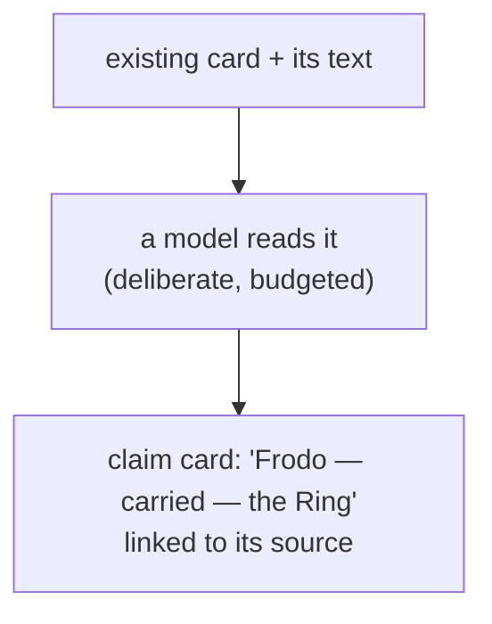

# Beyond finding: Swarm reading its own memory

> **Plain-language guide.** The precise design lives in the
> [enrichment control plane](../../swarm/docs/design/enrichment-control-plane.md) and
> [claim typing](../../swarm/docs/decisions/0011-graph-zones-and-claim-typing.md).

Everything so far has been **retrieval**: find what was stored, and follow its links.
Swarm can also take one step further — read its own cards and **write down the claims it
finds**, for example "Frodo carried the Ring". That extracted layer is what turns a search
engine into something closer to memory. It is built, validated, and **off by default**.

## What it does

A worker reads a card's text and extracts simple statements — *subject – relation –
object* — then writes them back as a new, separate kind of card: a **claim**, linked to the
evidence it came from.

## Two rules keep it honest

- **A claim is not independent evidence.** A model agreeing with what it just read is not a
  second witness. Claims are a separate *kind* of card and collapse to a single voice in
  the trust score, so the system cannot reason itself into false confidence
  ([trust.md](trust.md), [origins.md](origins.md)).
- **It is off by default.** Reading a source with a model takes minutes, not milliseconds.
  So it never runs continuously — it fires **deliberately**, on a budget, only for cards
  worth it: ones asked about often, central in the graph, or where evidence conflicts. This
  is the project's **cost-asymmetry** rule — cheap work runs always, expensive work runs
  rarely.

## Why this matters

Retrieval answers "where is this mentioned?" The claim layer starts to answer "what do we
*know*?" — relationships the raw text never stated in one place. It is the difference
between a very good search and a memory that reasons. Today it is **proven but parked**:
switched on only for a deliberate, measured run, never as the always-on default.

Back to the start: [README.md](README.md).
