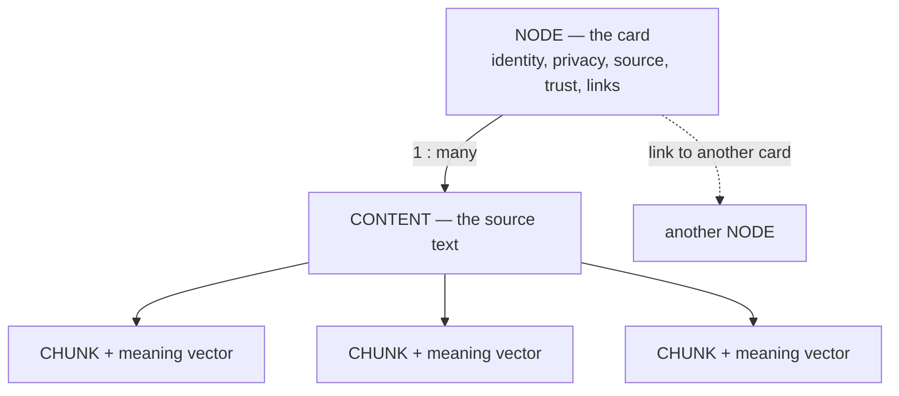
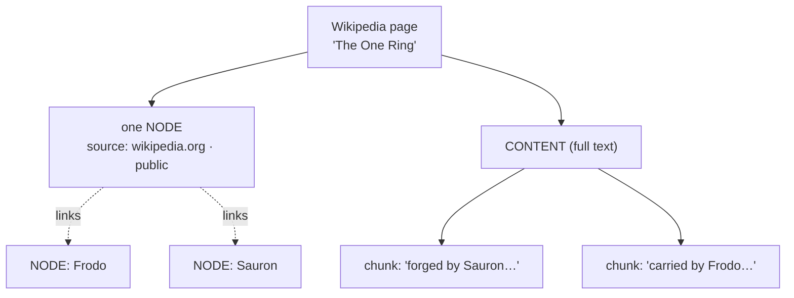

# How Swarm stores what it knows

> **Plain-language guide.** This page explains the *idea*. For the exact,
> implementable contract, see the
> [data-model decision](../../swarm/docs/decisions/0014-data-memory-model.md) and its
> [spec](../../swarm/docs/design/data-memory-model.md).

## The problem this solves

`grep` matches letters. Search for "ring" and it finds the letters r-i-n-g — and misses
"the One Ring", "Sauron's band of power", or the same idea in another language. It has no
notion of *meaning*.

Swarm's whole job is to search **meaning**, not letters: to know that two pages about the
same thing are *one* memory, and that "Allmusic" and "AllMusic" are *one* name. To do
that, it cannot just dump text in a file and grep it. It stores knowledge in a shape
built for meaning. This page explains that shape.

## Two separate things: a card and its text

Swarm splits every memory into two parts that live apart:

- a **node** — a small *card* that records *what this is* and *how it connects* to other
  cards;
- its **content** — the actual text, kept separately and cut into small pieces called
  **chunks**.

The split is deliberate. The card is light and lives in a web of connections. The text is
heavy and sits on a "shelf" beside the card. A single link joins them — nothing more.

## The node (the card)

A node is small and holds only:

- **identity** — what kind of thing it is, plus a unique key (for example, the Wikipedia
  page "The One Ring");
- **privacy** — public or private; this decides who is allowed to see it;
- **source** — where it came from (which site, which connector);
- **links** — connections to other nodes ("this page links to that one");
- **trust** — how confident Swarm is about it.

There is roughly **one node per source**. One Wikipedia page is one node.

This "one source, one card" rule matters more than it looks. If you chopped a single page
into fifty cards, those fifty would later look like fifty *independent* sources for the
same fact — and Swarm would talk itself into false confidence. Keeping the card coarse
keeps trust honest. (More in [trust.md](trust.md).)

## The content and chunks (the text)

The page's text does **not** sit on the card. It is stored as **content**, then cut into
**chunks** — short passages, usually one per section.

Each chunk carries a **vector**: a fixed list of numbers (1024 of them, in our case) that
captures the passage's *meaning*. Think of it as coordinates of a point in a "space of
meaning" — passages about the same idea land close together, even when they share no
words. That is what lets Swarm find "the One Ring" when you searched for "the ring".
(How search uses this is in [search.md](search.md).)

A chunk is deliberately **inert**. It can be *found* by a search, but it cannot:

- have its own privacy setting (it borrows the card's);
- link to other things;
- count as evidence on its own.

In one line: **a chunk can be found, but it cannot vote.** Only the card it belongs to
carries weight in the graph.

## A worked example

Take the Wikipedia page "The One Ring".

1. It becomes **one node**: identity "The One Ring", public, source "wikipedia.org", with
   links to "Frodo", "Sauron", and "Mordor".
2. Its text is stored as **content**, then sliced into **chunks** — one per section, each
   with its own meaning vector.
3. Later you search "the ring". The search rummages the shelf of chunks, but every match
   hands back its **parent card** — so you always know *which page* it came from, and you
   can then follow that page's links to related cards.

## Where this is pinned down precisely

This page is the plain version. The exact data shapes, rules, and trade-offs live in the
specialist canon:

- decision and rationale — [data-model decision](../../swarm/docs/decisions/0014-data-memory-model.md);
- the implementable spec — [data-memory-model spec](../../swarm/docs/design/data-memory-model.md).

Next in this guide: how the two indexes — by word (an *inverted index*) and by meaning
(*vectors*) — turn a search into matches ([search.md](search.md)), and what the web of
links buys you ([the-graph.md](the-graph.md)).
