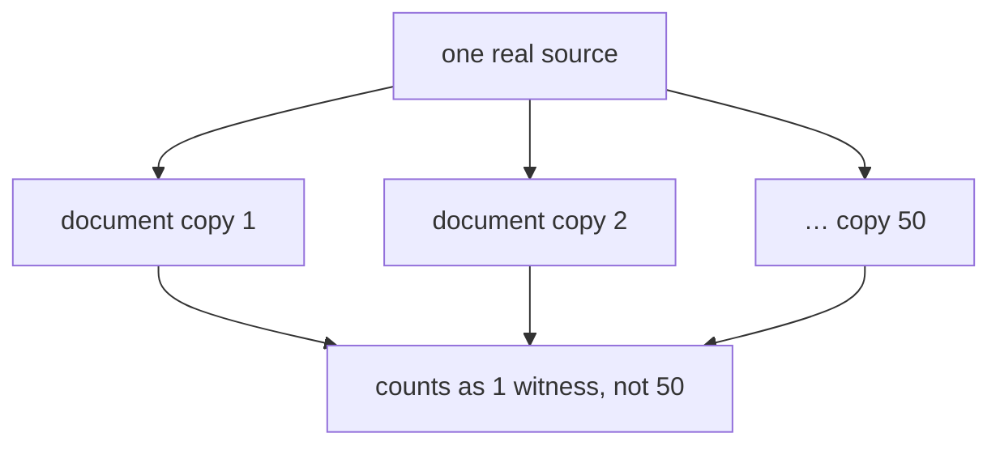

# What counts as one piece of evidence

> **Plain-language guide.** The precise rules live in the
> [confidence calculus](../architecture/confidence-calculus.md) (strength dimension), the
> [evidential-origin decision](../decisions/0013-evidential-origin.md), and its
> [spec](../../swarm/docs/design/evidence-origin-substrate.md).

Trust grows when **independent** sources agree ([trust.md](trust.md)). But that raises a
sharp question: what counts as *one* source? Get this wrong and the whole trust score is
fooled.

## The trap: one rumour, fifty copies

Suppose one rumour is copied into fifty documents. If Swarm counted **documents**, it would
see fifty "witnesses" and become very confident — about something a single source said
once. Counting the wrong thing manufactures false certainty.

## The rule: count distinct origins, not events

Every piece of evidence carries an **origin** — the identity of *where it really came
from*, not *when it arrived*. Swarm counts **distinct origins**. So:

- re-posting the same fact reuses the same origin → it adds **no** new vote;
- it also does **not** reset the "freshness" clock, so a constantly re-posted rumour cannot
  stay alive forever on repetition alone (the "immortal memory" hazard, closed);
- connectors stamp a stable origin **at the door**, where the true source is actually
  known.

This is the same idea as "one source, one card" ([memory-model.md](memory-model.md)) and
"a chunk cannot vote" ([trust.md](trust.md)), applied to repeated evidence: identity is
about *origin*, never about how many times something showed up.

## The honest remainder

One hard case is left open on purpose: sources that are quietly *derived from one another*
(A copies B copies C) look like separate origins until you trace the lineage — and doing
that across a huge corpus is expensive. Swarm defers it until real data actually overlaps
that way. The blunt double-counting (the same origin, many times) is **closed**; the subtle
lineage case is **deferred**, not pretended away.

Next: [trust.md](trust.md).
