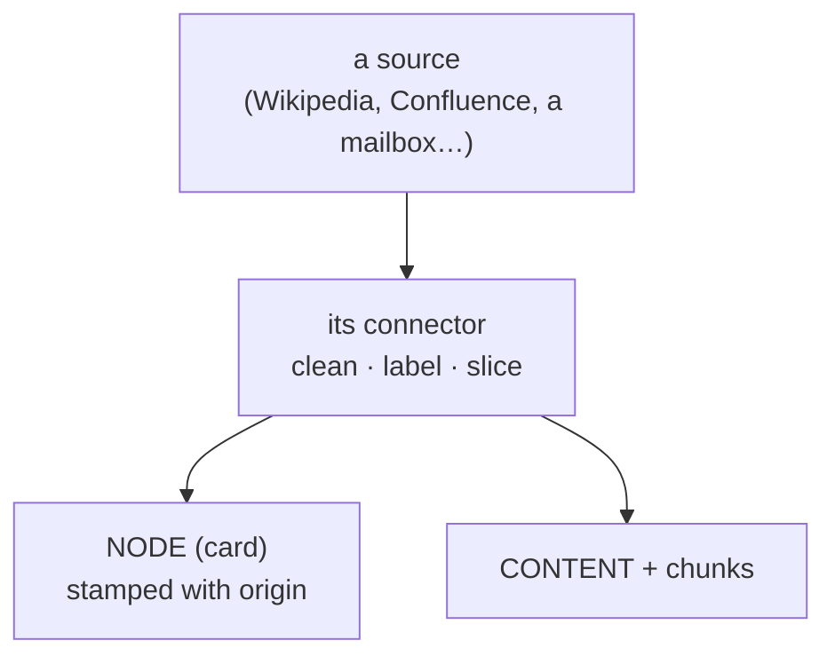
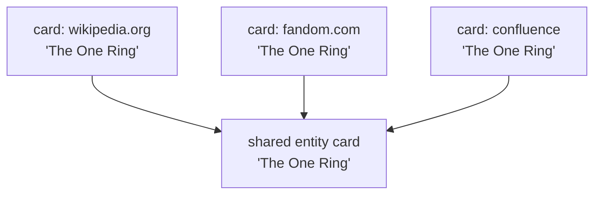

# Where it came from

> **Plain-language guide.** The precise rules live in
> [entity resolution](../../swarm/docs/decisions/0013-entity-resolution.md) and the
> [connector contract](../../swarm/docs/decisions/0005-connector-ingestion-contract.md).

Every card is stamped with its **origin** — which source it came from, and through which
connector. That stamp answers two everyday questions: *how does data get in?* and *how do
I search within one source and not another?*

## How data gets in: connectors

You do not pour raw data straight into Swarm. Each kind of source gets a **connector** — a
small adapter that knows that source's quirks. The connector pulls the data, **cleans and
labels it**, and hands Swarm finished cards, text, and links. The core never sees the raw
mess; the connector absorbs it.

Cleaning at the connector is also where messy names get fixed — turning two spellings of
one title into one card (for example "Allmusic" and "AllMusic"). That is what makes "two
pages about one thing are one memory" actually true.

## Searching within one source

Because every card knows its origin, narrowing a search to one source is just a **filter**
— the same kind of filter that enforces privacy (public vs private). "Search Wikipedia,
not the fan wiki" becomes: keep only cards stamped `wikipedia.org`.

And to scope by *topic* rather than source — "the ring in Tolkien, not in fairy tales" —
you lean on the graph instead: start from the "Tolkien" card and follow its links
([the-graph.md](the-graph.md)).

## The same page on two sites

What if Wikipedia, a fan wiki, and an internal Confluence all have a page about the ring?
That is **three different sources**, so they stay **three separate cards**, each with its
own origin stamp. But they are about the **same thing**, so all three link to **one shared
"The One Ring" card**.

So you can ask it either way: *"what does Wikipedia say about the ring?"* (filter by
source) or *"what do we know about the ring, across everything?"* (the shared card). And
because origin feeds trust ([trust.md](trust.md)), the official source and the fan wiki
can be weighed differently.

Back to the start: [memory-model.md](memory-model.md).
