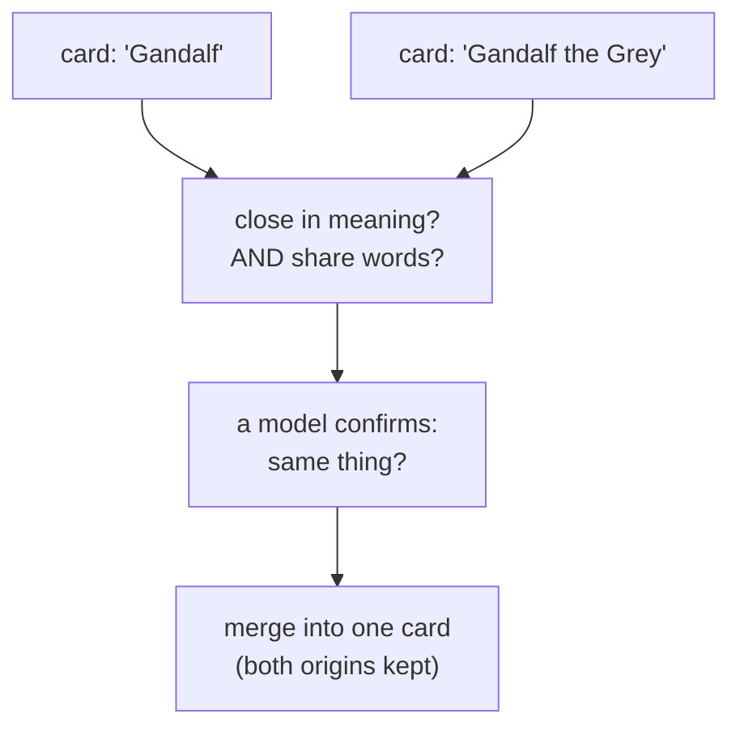

# Making one memory out of many

> **Plain-language guide.** The precise rules live in
> [entity resolution](../../swarm/docs/decisions/0013-entity-resolution.md) and the
> [data-memory-model spec](../../swarm/docs/design/data-memory-model.md).

Swarm's founding promise is that *two pages about one thing are one memory* and *two
spellings of a name are one name*. That does not happen by itself — real sources are
messy. This page is about how duplicates **fold** into a single card.

## Two ways a duplicate gets caught

**By the book — exact rules.** A connector knows its own source's quirks, so it fixes them
at the door: "Allmusic" and "AllMusic", a percent-encoded title, a page that redirects to
another — all folded into one card on the way in. A small **alias table** remembers "this
spelling means that card", and it is reversible, so a wrong fold can be undone.

**By meaning — soft-match.** Sometimes two cards share no obvious spelling but are clearly
about the same thing. Swarm catches these with the card's **identity vector** (its meaning,
see [memory-model.md](memory-model.md)): it finds cards that are close in meaning, then
applies a deliberately strict test before merging anything.

## Precision first — a wrong merge is the expensive mistake

The soft-match gate is strict on purpose, because merging two things that are *not* the
same poisons the memory, and that is costly to undo:

- it must be **close in meaning** (vectors near) **and** **share words** — either signal
  alone over-proposes;
- then a model has to **confirm** it; any doubt means **no merge**.

So Swarm would rather miss a merge than make a wrong one. "Gandalf" and "Gandalf the Grey"
fold together; "Gandalf" and "Saruman" stay apart, however much they have in common.

When two cards do merge, **both origins are kept** — the merged card still remembers it was
seen in two places, which matters for how sure Swarm is ([origins.md](origins.md)).

This soft-match is **off by default** and runs deliberately, not on every page — it costs a
model call, and Swarm spends those rarely (see [cognition.md](cognition.md)).

Next: [provenance.md](provenance.md).
