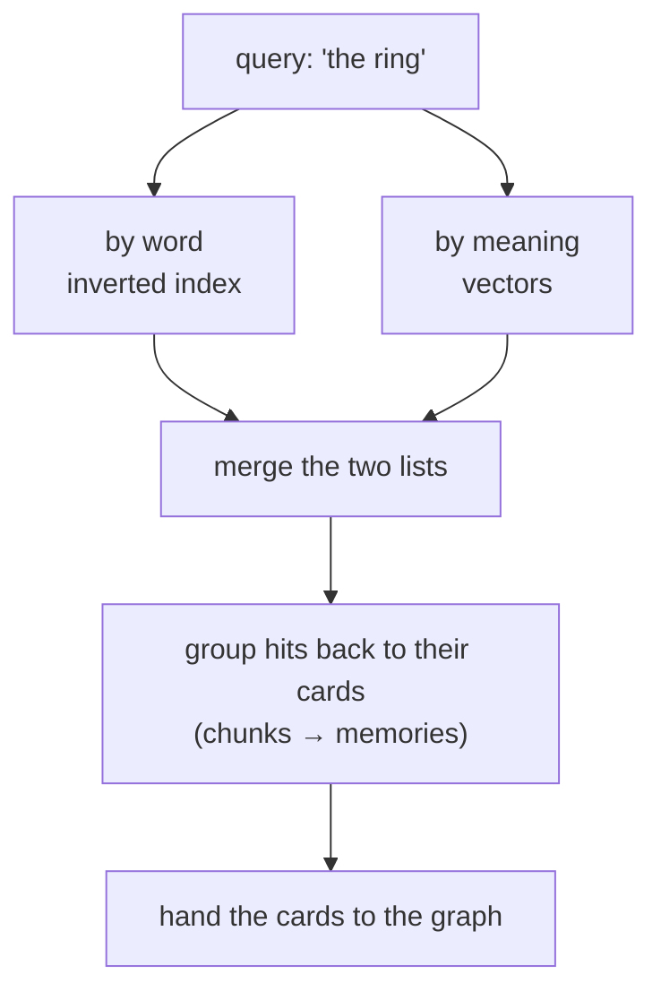

# How Swarm finds things

> **Plain-language guide.** The precise retrieval design is in the
> [data-memory-model spec](../../swarm/docs/design/data-memory-model.md), section 5.

You already know the shape ([memory-model.md](memory-model.md)): small **cards** (nodes)
in a graph, with the text kept beside them as **chunks**. This page explains how a search
turns into matches.

## Two indexes, because words and meaning fail differently

An **index** is a lookup table built ahead of time, so you find things without scanning
everything. Swarm keeps two of them over the chunks.

- **By word — an *inverted index*.** Like the index at the back of a book: each word
  points to the list of places it appears. It is excellent for exact names, codes, and
  rare words ("Silmarillion") — but blind to meaning, so "ring" will not find "band of
  power".
- **By meaning — *vectors*.** Each chunk is a point in a "space of meaning" (a list of
  numbers). The query becomes a point too, and Swarm finds the **nearest** points. It is
  excellent for paraphrase and synonyms — but weak on exact rare strings, which it can
  miss.

They fail in *opposite* ways. So Swarm runs **both** and merges the two ranked lists into
one (a standard recipe called reciprocal-rank fusion). The result is keyword precision
*and* meaning, in one pass — this is the "grep on steroids" idea made real.

## Two stages: find, then group

1. **Find candidate chunks** with the two indexes above.
2. **Group those chunks back to their cards.** Twelve matching chunks from three pages
   become "found in three memories". Every result carries its **parent card** plus the
   exact passage — you always know *which page* and *where*.

From there, the graph takes over ([the-graph.md](the-graph.md)) to turn "matching pages"
into "the one memory or entity you meant".

## What search will not do (on purpose)

To stay cheap and fast, search deliberately avoids expensive shortcuts: it does **not**
ask a large language model to re-read and re-rank every result on each query, and it does
**not** summarise the whole corpus with a model. Those are rare, deliberate steps, not the
default. (Why cost shapes the design: [trust.md](trust.md) and the cost notes in the
canon.)

## Example

You search **"the ring"**. The word index catches pages that literally say "ring"; the
meaning index also catches "the One Ring" and "Sauron's band". The two lists merge, group
by page, and hand back the cards for "The One Ring", "Frodo", and a couple of others —
each with the passage that matched. Next, the graph lets you follow those cards' links.

Next: [the-graph.md](the-graph.md).
