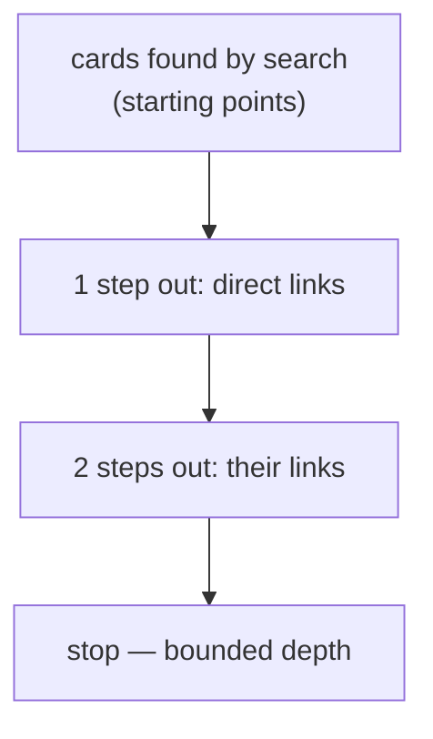
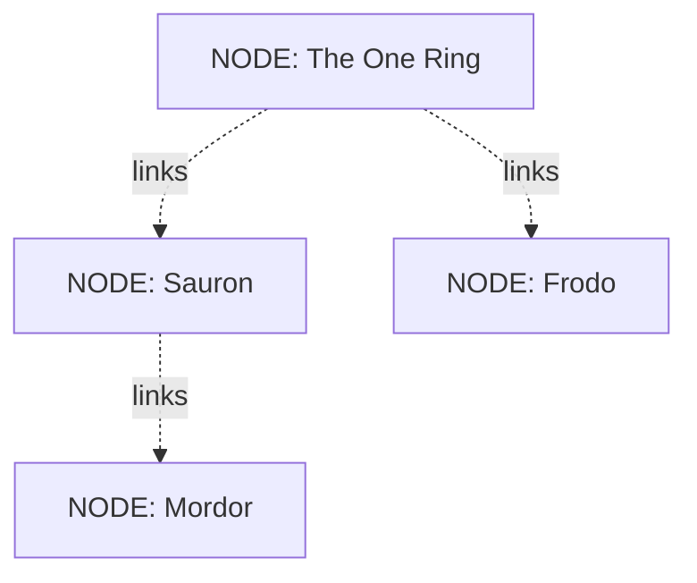

# Following the links

> **Plain-language guide.** The precise traversal and cost limits are in the
> [data-memory-model spec](../../swarm/docs/design/data-memory-model.md) and the
> [confidence calculus](../architecture/confidence-calculus.md).

The cards (the *nodes* from [memory-model.md](memory-model.md)) are not a flat pile — they
are connected. One page links to another; a person links to the works they appear in.
Those connections form a **graph**: cards are the points, links are the lines between them.
This page is about what that buys, and one trap to avoid.

## Finding is not walking

These two are easy to confuse, so keep them apart:

- **Finding mentions** — "where is the ring mentioned?" — is a job for the **indexes**
  ([search.md](search.md)). It looks in a prepared lookup table and answers almost
  instantly, no matter how big the memory is. **It does not walk the graph.**
- **Following connections** — "how is the ring related to Mordor?" — is a job for **graph
  traversal**: stepping from card to card along the links.

So to answer "find every mention of the ring", Swarm does **not** tour the whole graph. It
asks an index. The graph comes in only for the *second* kind of question.

## Why traversal is always bounded

Walking *every* path through a large graph blows up fast: each step multiplies the number
of paths, so a few steps into a dense graph means millions of routes. (Swarm measured
exactly where this becomes a wall.) So traversal is always **bounded**: it starts only
from the cards a search already found, and it follows links just a few steps out — never
the whole tree.

## What the graph buys you

Two things flat search cannot do:

- **Multi-hop questions** — "what connects the ring to Mordor?" — answered by following a
  chain of links (ring → Sauron → Mordor), not by matching a single passage.
- **Entity-centric questions** — "everything about this thing, under all its names" —
  answered because aliases resolve to one card, and that card's links gather the rest.

This is also where Swarm works out **how sure** it is, by weighing the paths between
cards — the subject of [trust.md](trust.md).

Next: [trust.md](trust.md).
