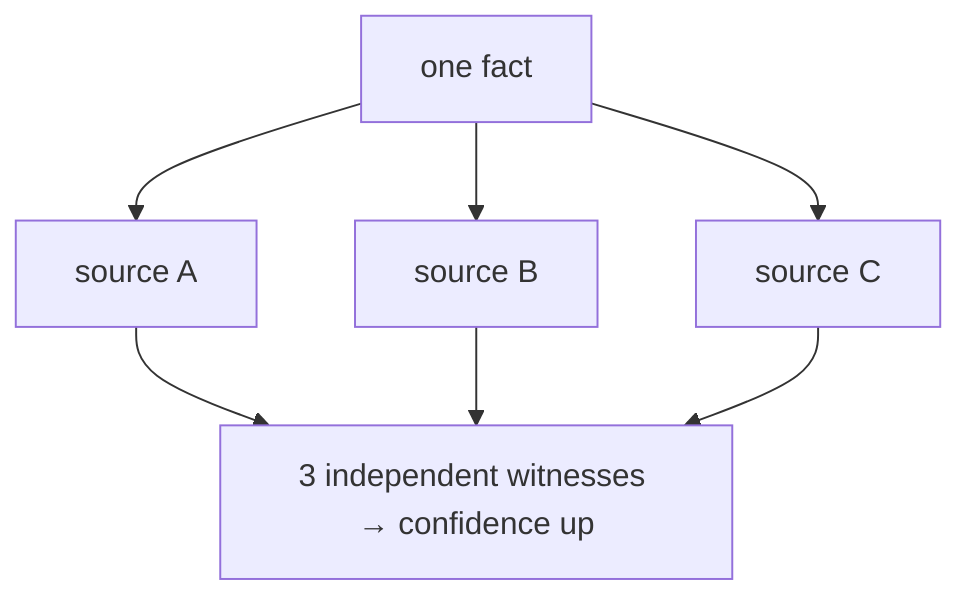

# How sure is Swarm?

> **Plain-language guide.** The precise rules live in the
> [confidence calculus](../architecture/confidence-calculus.md) and
> [claim typing](../../swarm/docs/decisions/0011-graph-zones-and-claim-typing.md).

Not everything Swarm knows is equally certain. Every card carries a **trust score**, and
Swarm raises or lowers it as evidence comes in. This page explains how — and the rules
that stop it from fooling itself.

## Trust grows from *independent* agreement

If several **separate** sources say the same thing, confidence should go up — that is real
corroboration. The key word is *separate*. Two echoes of one source are not two witnesses;
they are one witness, twice.

This is why the design insists on **one source, one card** (see
[memory-model.md](memory-model.md)). If a single page were chopped into fifty cards, those
fifty would later look like fifty independent witnesses to the same fact, and Swarm would
talk itself into false certainty. Keeping the card coarse keeps the count honest.

## Two rules that prevent fake confidence

- **Chunks do not vote.** A passage of text can be *found* by a search, but it is not a
  witness on its own. Only the card it belongs to carries weight. (This is the one idea
  the whole guide hangs on.)
- **Guesses do not count as independent witnesses.** When a language model later infers
  something from existing cards, that inference is marked as a *claim*, not fresh
  evidence. A burst of model-generated claims about one fact collapses to a single voice,
  so the model cannot agree with itself into certainty.

## Some sources are trusted more than others

Where a card came from also feeds its trust. An official reference and a fan wiki can be
weighted differently — the origin (see [provenance.md](provenance.md)) is part of the
score, not just a label.

## An honest open problem

Telling genuinely independent evidence apart from many echoes of one origin is the hardest
part, and it is **not fully solved** — it is active work in the kernel. The rules above
contain the problem (coarse cards, silent chunks, collapsed claims) but do not make it
disappear. When this guide says Swarm is "sure", read it as "sure given what it can
currently tell apart".

Next: [provenance.md](provenance.md).
